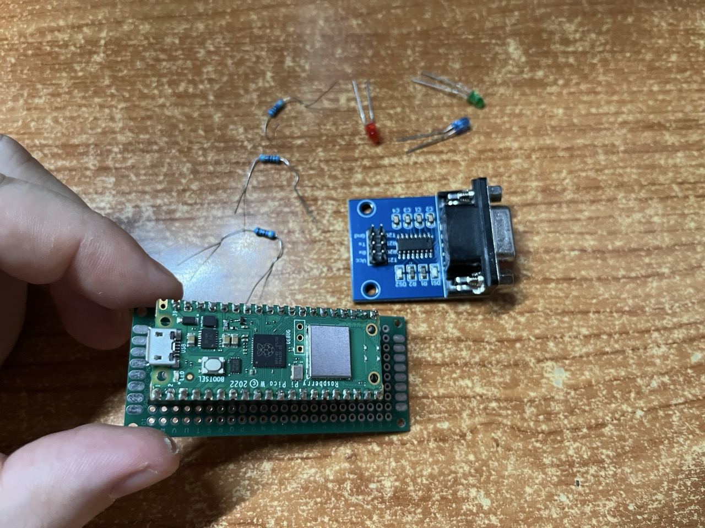
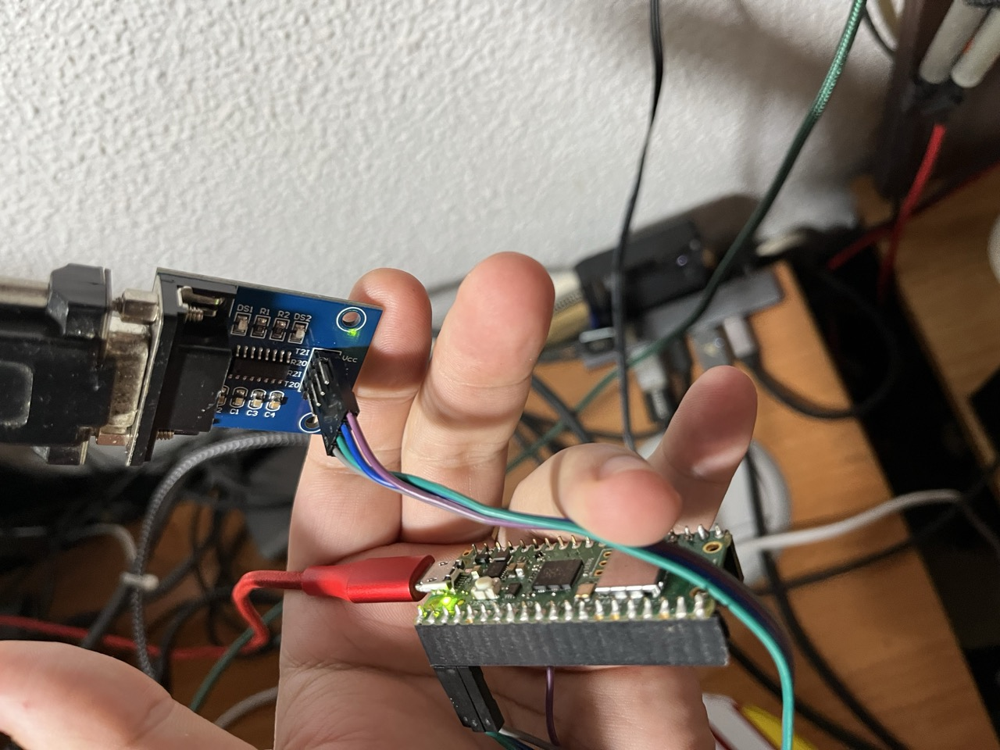
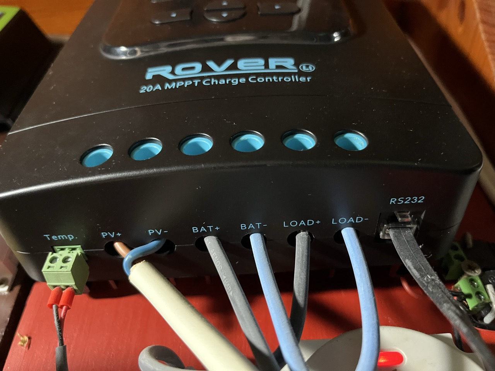
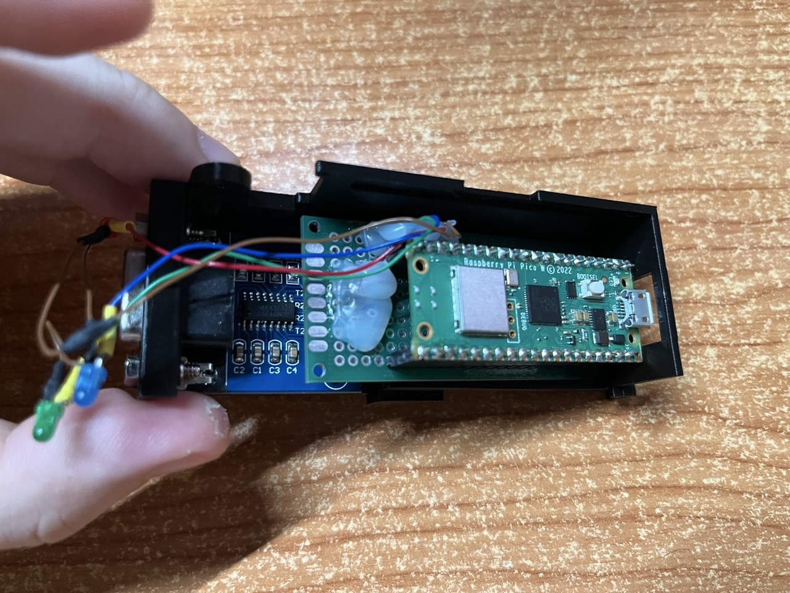
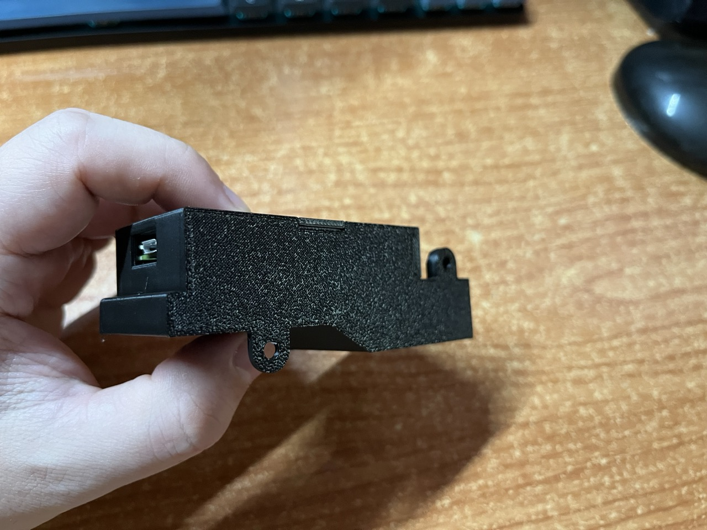
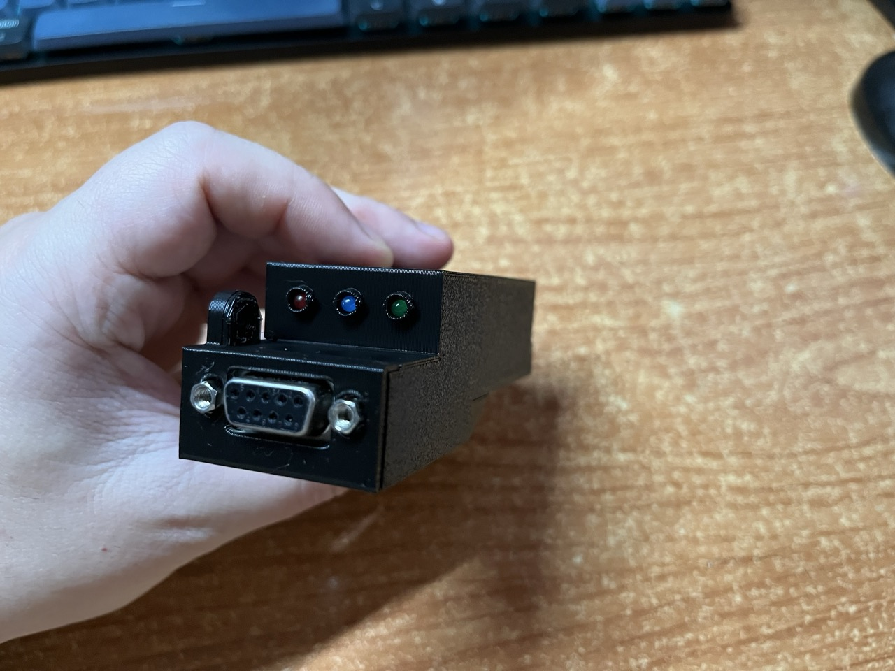
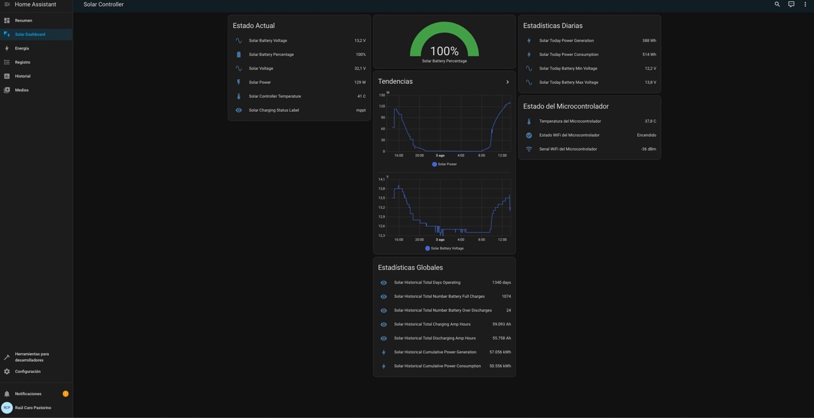
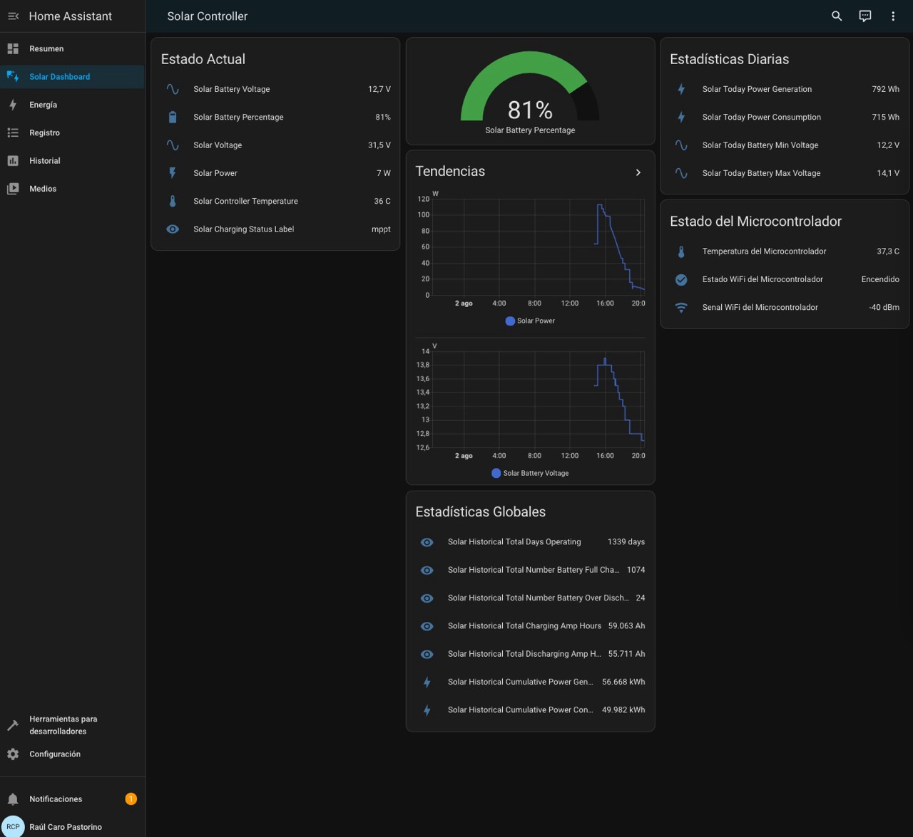
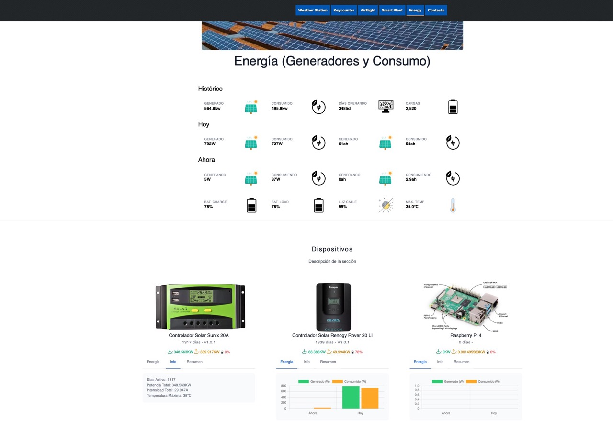
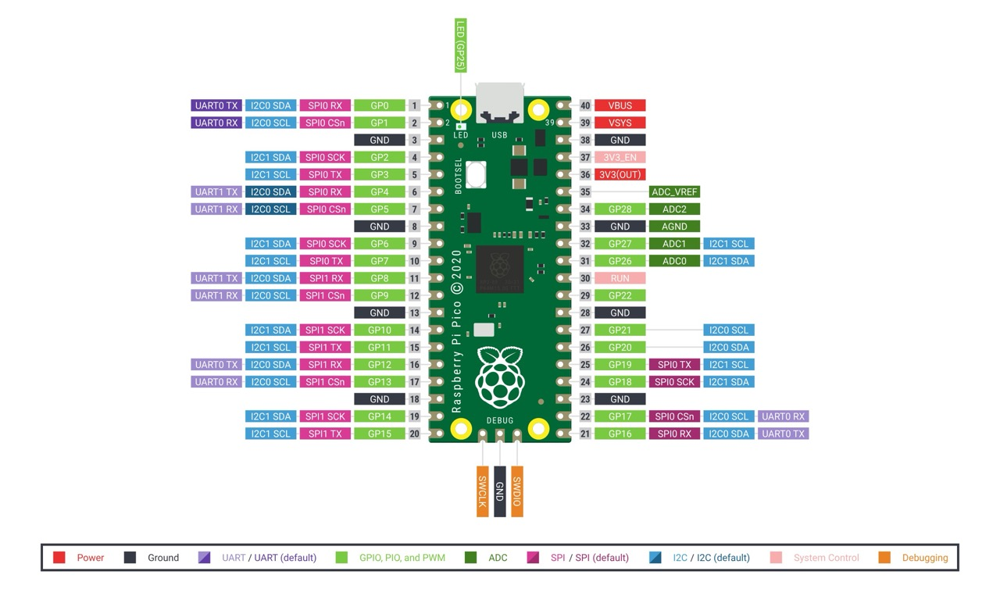

# Raspberry Pi Pico Monitor para el Controlador Solar Renogy Rover LI

## Descripción del Proyecto

Este proyecto permite monitorizar un controlador solar **Renogy Rover LI** utilizando una **Raspberry Pi Pico** con MicroPython. El sistema recopila datos del controlador solar a través de una conexión RS232 y ofrece las siguientes funcionalidades:

- Lectura de parámetros del controlador solar (voltaje, corriente, potencia, temperatura, etc.)
- Envío de datos a una API personalizada para almacenamiento y análisis
- Integración con Home Assistant para visualización y monitorización en tiempo real
- Indicadores LED para mostrar el estado del sistema
- Soporte para conexión WiFi (con la Raspberry Pi Pico W)

## Imágenes del Hardware

### Hardware del Proyecto
<p align="center">
  
  
  
</p>

### Diseño 3D del Hardware
<p align="center">
  
  
  
</p>

## Autor y Repositorio

- **Autor:** Raúl Caro Pastorino
- **Web:** [https://raupulus.dev](https://raupulus.dev)
- **Repositorio:** [https://gitlab.com/raupulus/rpi-pico-monitor-renogy-rover-li-solar-controller](https://gitlab.com/raupulus/rpi-pico-monitor-renogy-rover-li-solar-controller)
- **Proyecto base:** [https://gitlab.com/raupulus/rpi-pico-template-project-micropython](https://gitlab.com/raupulus/rpi-pico-template-project-micropython)

## Características Principales

- **Modelos Modulares**: El proyecto utiliza una arquitectura modular con clases especializadas:
  - **API**: Facilita la interacción con APIs externas para enviar y recibir datos
  - **RpiPico**: Gestiona la Raspberry Pi Pico, incluyendo conectividad WiFi, ADC integrado, información de red y soporte para redes alternativas
  - **RenogyRoverLi**: Implementa la comunicación con el controlador solar mediante protocolo Modbus
  - **SerialConnection**: Maneja la comunicación serial RS232 con el controlador
  - **HomeAssistantConnection**: Gestiona la integración con Home Assistant

- **Configuración Flexible**: Mediante el archivo de variables de entorno `.env.py` (basado en `.env.example.py`) se pueden personalizar todos los aspectos del sistema

- **Monitorización Visual**: Soporte para LEDs externos que indican el estado del sistema en tiempo real

## Integración con Home Assistant - Capturas

### Paneles de Home Assistant
<p align="center">
  
  
</p>

### Datos enviados a la API
<p align="center">
  
</p>

## Requisitos

### Software
- IDE/Editor (como Thonny, PyCharm o VSCode)
- [MicroPython 1.25](https://micropython.org/download/rp2-pico/) o superior 
  instalado en la Raspberry Pi Pico

### Hardware
- Raspberry Pi Pico (preferiblemente Pico W para funcionalidad WiFi)
- Controlador solar Renogy Rover Li
- Conversor TTL a RS232 para la comunicación con el controlador
- Opcional: LEDs externos para indicación visual del estado

## Contenido del Repositorio

- **src/**: Código fuente del proyecto.
  - **src/Models/**: Modelos/Clases para separar entidades que intervienen.
  - **src/tests/**: Scripts de prueba y verificación para el proyecto.
- **docs/**: Documentación adicional, esquemas y guías de instalación.
- **3d Design/**: Archivos de diseño 3D para la caja del microcontrolador.

## Archivos de Diseño 3D

Este proyecto incluye archivos de diseño 3D para crear una caja personalizada que aloje la Raspberry Pi Pico junto con el conversor RS232. Los archivos están disponibles en el directorio `3d Design/`:

### Archivos Disponibles

- **[Renogy Rover LI Raspberry pi pico - Base.stl](3d%20Design/Renogy%20Rover%20LI%20Raspberry%20pi%20pico%20-%20Base.stl)**: Archivo STL de la base de la caja
- **[Renogy Rover LI Raspberry pi pico - Cover.stl](3d%20Design/Renogy%20Rover%20LI%20Raspberry%20pi%20pico%20-%20Cover.stl)**: Archivo STL de la tapa de la caja
- **[Renogy Rover LI Raspberry pi pico.3mf](3d%20Design/Renogy%20Rover%20LI%20Raspberry%20pi%20pico.3mf)**: Archivo 3MF completo con el proyecto

### Características del Diseño

- Diseñado específicamente para alojar la Raspberry Pi Pico y el conversor TTL a RS232
- Incluye espacios para la conexión de cables
- Diseño modular con base y tapa separadas
- Optimizado para impresión 3D

> **Nota**: Estos archivos están listos para imprimir en cualquier impresora 3D compatible con archivos STL o 3MF.

## Instalación y Configuración

### Preparación del Hardware

1. Conecta el conversor TTL a RS232 a la Raspberry Pi Pico según el [diagrama de conexiones](docs/CONNECTION_DIAGRAM.md)
2. Conecta el conversor RS232 al controlador solar Renogy Rover Li
3. Opcionalmente, conecta los LEDs externos a los pines GPIO correspondientes

### Instalación del Software

1. **Instalación de MicroPython:**
   - Asegúrate de que MicroPython esté instalado en tu Raspberry Pi Pico
   - Sigue las instrucciones en la [documentación oficial de MicroPython](https://docs.micropython.org/en/latest/rp2/quickref.html)

2. **Instalación del Proyecto:**
   - Descarga o clona este repositorio
   - Copia el archivo `.env.example.py` a `env.py`
   - Configura las variables en `env.py` según tus necesidades:
     - Configuración WiFi
     - Credenciales de la API
     - Token de Home Assistant (opcional)
     - Pines GPIO para LEDs (opcional)
   - Copia todos los archivos de la carpeta `src/` a la Raspberry Pi Pico

3. **Verificación de la Instalación:**
   - Reinicia la Raspberry Pi Pico
   - El LED integrado debería encenderse, indicando que el programa está en ejecución
   - Si configuraste LEDs externos, el LED de encendido debería iluminarse

## Diagrama de Conexiones

El siguiente diagrama muestra el esquema de conexiones entre la Raspberry Pi Pico y el controlador solar Renogy Rover Li:

### Raspberry Pi Pico a Conversor TTL-RS232

| Raspberry Pi Pico | Conversor TTL-RS232 |
|-------------------|---------------------|
| GPIO0 (Pin 1) - TX | RX                 |
| GPIO1 (Pin 2) - RX | TX                 |
| 3.3V (Pin 36)     | VCC (si es compatible con 3.3V) |
| GND (Pin 38)      | GND                 |

### Conversor TTL-RS232 a Renogy Rover Li

| Conversor TTL-RS232 (lado RS232) | Puerto RJ12 Renogy Rover Li |
|----------------------------------|----------------------------|
| TX                               | RX (Pin 3 en RJ12)        |
| RX                               | TX (Pin 4 en RJ12)        |
| GND                              | GND (Pin 5 en RJ12)       |

> **Nota:** Si tu conversor TTL-RS232 requiere 5V, usa el pin VSYS (Pin 39) o el pin de salida 5V en lugar de 3.3V. El pinout RJ12 puede variar, consulta el manual de tu Renogy Rover Li para confirmar los pines correctos.

Para más detalles sobre las conexiones, consulta la [documentación de conexión](docs/CONNECTION_DIAGRAM.md).

## Indicadores LED

El proyecto soporta tres LEDs externos opcionales para indicar diferentes estados:

1. **LED de Encendido**: Indica que el programa está en ejecución. Permanece encendido mientras el programa está activo.
2. **LED de Subida**: Indica cuando se están subiendo datos a la API o a Home Assistant. Parpadea durante las operaciones de subida.
3. **LED de Ciclo**: Indica cuando se está leyendo datos del controlador solar. Se enciende durante la lectura de datos.

Para configurar estos LEDs, define los siguientes parámetros en tu archivo `env.py`:

```python
# Configuración de LEDs externos (opcional)
# Si no se configuran, el programa funcionará sin usar LEDs externos
LED_POWER_PIN = 15  # Número de pin GPIO para LED de encendido
LED_UPLOAD_PIN = 14  # Número de pin GPIO para LED de subida a API/Home Assistant
LED_CYCLE_PIN = 13  # Número de pin GPIO para LED de trabajo del ciclo
```

Si no deseas utilizar alguno de estos LEDs, simplemente no definas la variable correspondiente o asígnale el valor `None`.

## Integración con Home Assistant

Este proyecto incluye una integración completa con Home Assistant, permitiendo visualizar todos los datos del controlador solar en tu panel de control. La integración está diseñada para agrupar automáticamente todas las entidades bajo un único dispositivo en Home Assistant.

### Configuración de Home Assistant

Para configurar Home Assistant con este proyecto:

1. Genera un token de acceso de larga duración en Home Assistant
2. Configura las variables `UPLOAD_HOME_ASSISTANT`, `HOME_ASSISTANT_URL` y `HOME_ASSISTANT_TOKEN` en tu archivo `env.py`
3. Reinicia la Raspberry Pi Pico para que comience a enviar datos a Home Assistant
4. Sigue las instrucciones detalladas en la [Guía Completa de Configuración de Home Assistant](docs/HOME_ASSISTANT_GUIDE.md)

### Herramientas de Prueba y Verificación

El proyecto incluye scripts de prueba y verificación en el directorio `src/tests/`:

1. **Verificación de Entidades** (`verify_entity_grouping.py`):
   - Verifica que todas las entidades existen en Home Assistant
   - Comprueba si las entidades están correctamente agrupadas
   - Corrige automáticamente problemas de agrupación
   - Proporciona un resumen detallado del estado de las entidades

   Para usar esta herramienta, ejecuta el siguiente código en tu Raspberry Pi Pico:
   ```python
   from tests import verify_entity_grouping
   ```

2. **Prueba de Creación de Dispositivo** (`test_device_creation.py`):
   - Verifica que el dispositivo se crea correctamente en Home Assistant
   - Comprueba la comunicación con Home Assistant
   - Muestra información detallada sobre el dispositivo creado

   Para usar esta herramienta, ejecuta el siguiente código en tu Raspberry Pi Pico:
   ```python
   from tests import test_device_creation
   ```

> **Nota**: Estos scripts están diseñados para ejecutarse en la Raspberry Pi Pico con los archivos del proyecto ya cargados, no en un entorno de desarrollo local.

### Documentación Adicional de Home Assistant

- [Guía Completa de Configuración](docs/HOME_ASSISTANT_GUIDE.md): Instrucciones detalladas para configurar Home Assistant
- [Solución para Problemas de Creación de Dispositivo](docs/DEVICE_CREATION_ISSUE_FIX.md): Solución para problemas de creación de dispositivos
- [Correcciones al Panel de Home Assistant](docs/PANEL_FIXES.md): Solución para problemas con entidades y tarjetas

## Documentación Técnica

### Protocolo Modbus

El controlador solar Renogy Rover Li utiliza el protocolo Modbus RTU sobre RS232 para la comunicación. Para entender cómo comunicarse con el controlador a nivel de protocolo, consulta la siguiente documentación:

- [Protocolo Modbus para Renogy Rover Li](docs/MODBUS_PROTOCOL.md): Documentación detallada sobre el protocolo Modbus, incluyendo direcciones de registros, tipos de datos, interpretación de valores y ejemplos de comandos y respuestas.

Esta documentación es especialmente útil si estás:
- Implementando tu propia solución para comunicarte con el controlador
- Depurando problemas de comunicación
- Extendiendo la funcionalidad del proyecto para leer registros adicionales
- Interesado en entender cómo funciona la comunicación a bajo nivel

## Licencia

Este proyecto está licenciado bajo la Licencia GPLv3. Consulta el archivo 
LICENSE para más detalles.


## Estado del Proyecto

El proyecto se encuentra en un estado funcional y estable. Se han implementado todas las funcionalidades principales:

- ✅ Lectura de datos del controlador solar Renogy Rover Li
- ✅ Envío de datos a API personalizada
- ✅ Integración con Home Assistant
- ✅ Soporte para LEDs externos de estado
- ✅ Optimización de rendimiento (caché de datos estáticos)
- ✅ Sincronización de hora con servidor NTP
- ✅ Monitorización del estado del microcontrolador

## Esquema de Pines - Raspberry Pi Pico

Para facilitar las conexiones del hardware, aquí tienes el esquema completo de pines de la Raspberry Pi Pico:

<p align="center">
  
</p>

> **Nota**: Este esquema te ayudará a identificar los pines correctos para las conexiones del conversor RS232, LEDs externos y cualquier otra conexión necesaria para el proyecto.
