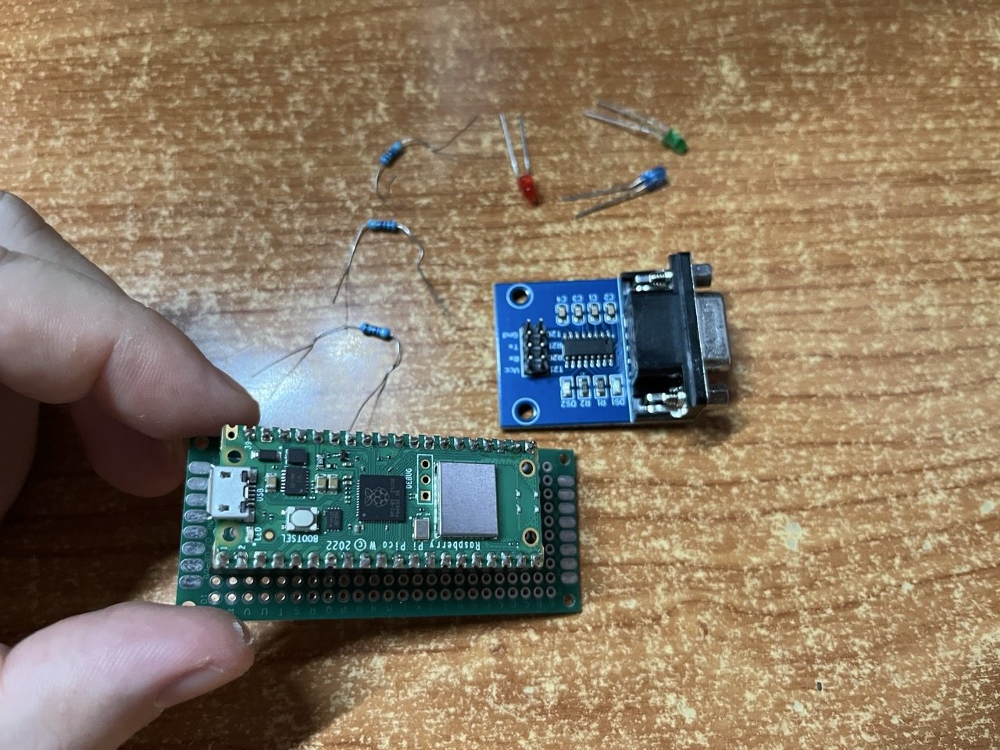
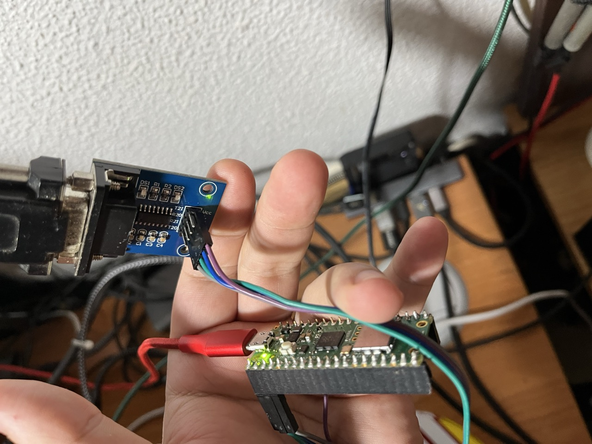
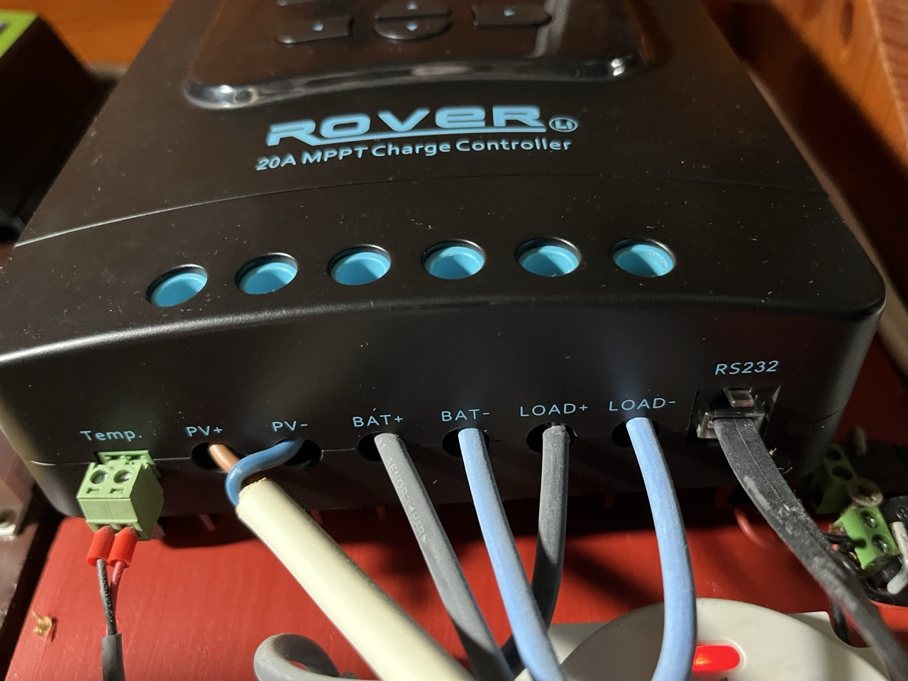
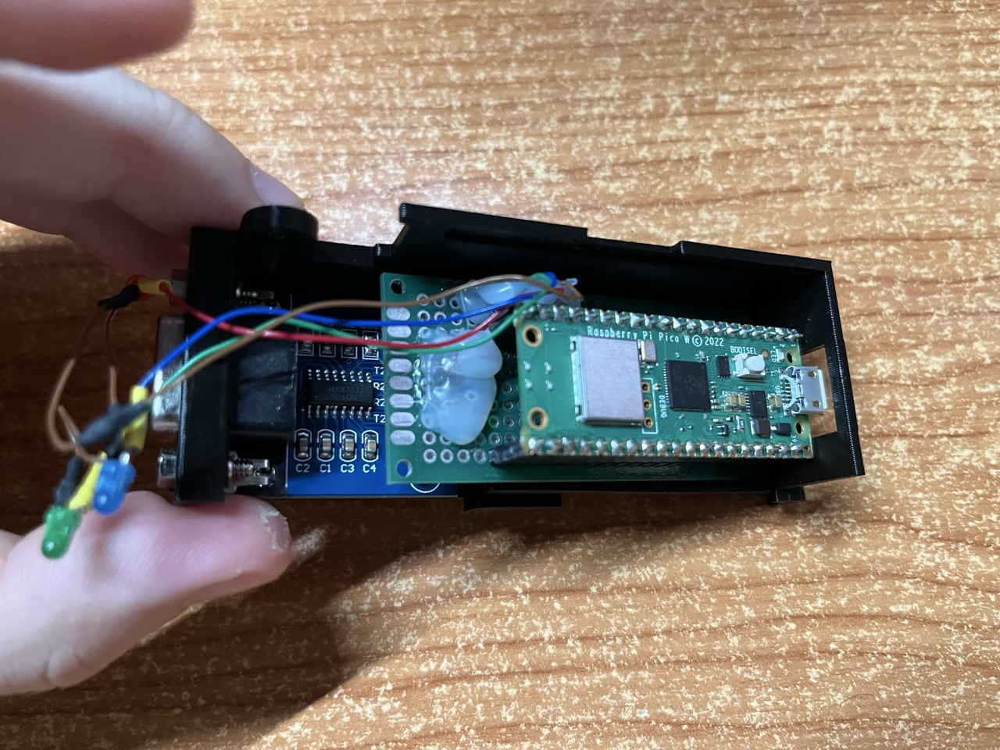
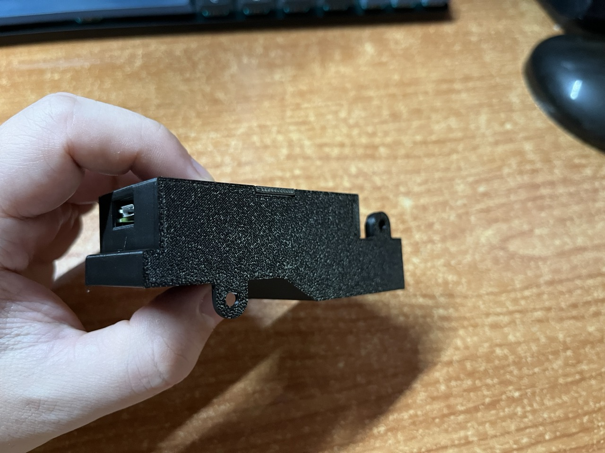
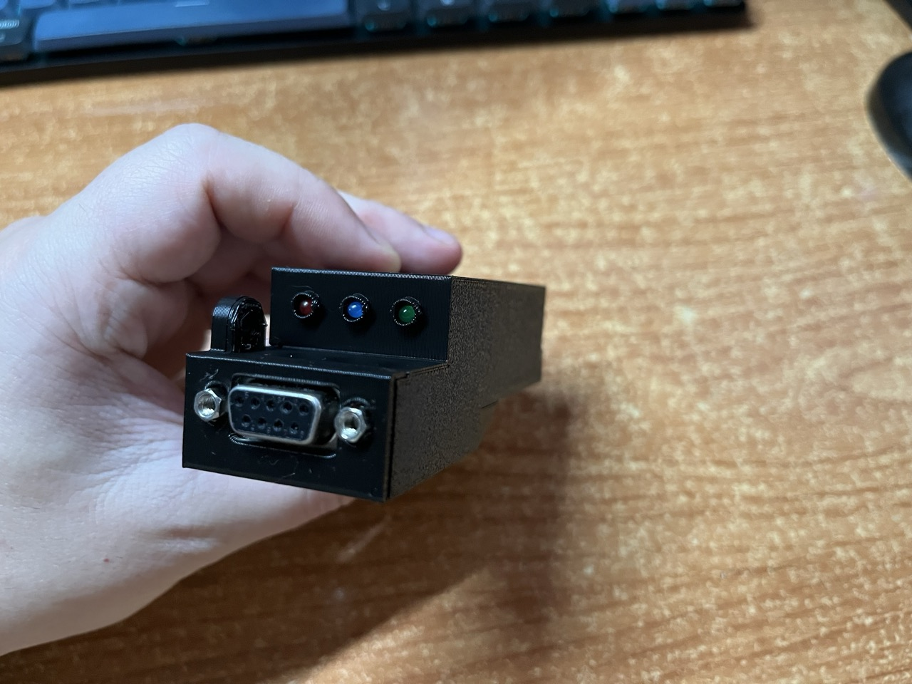
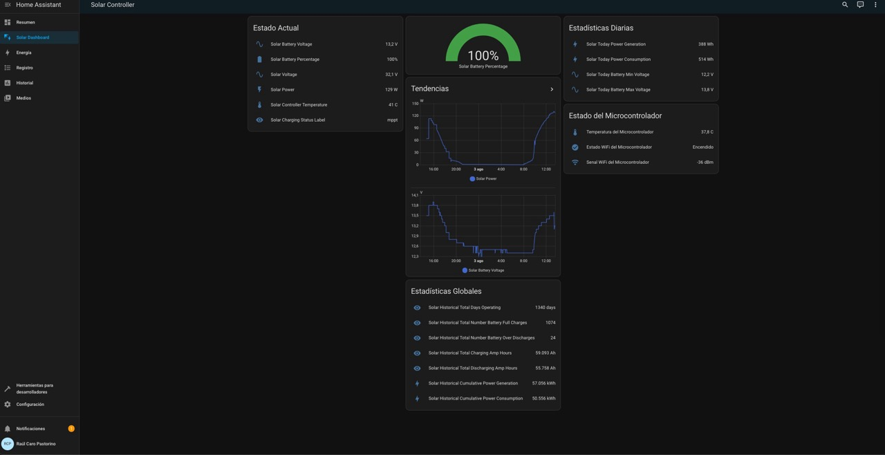
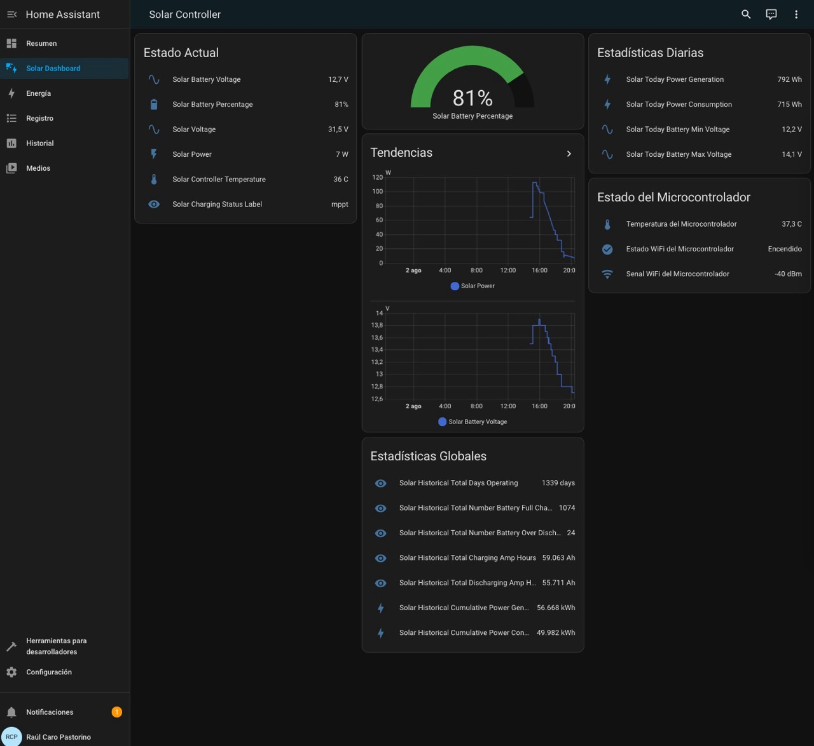
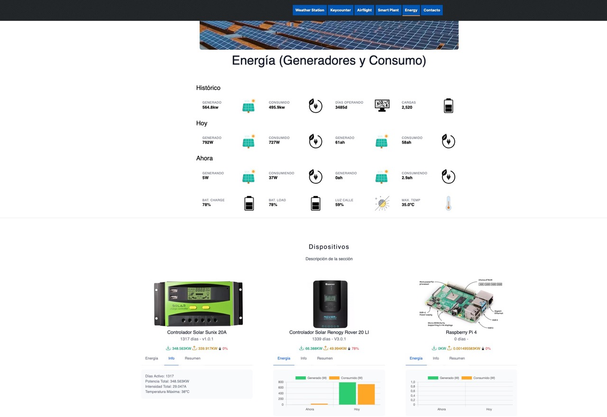
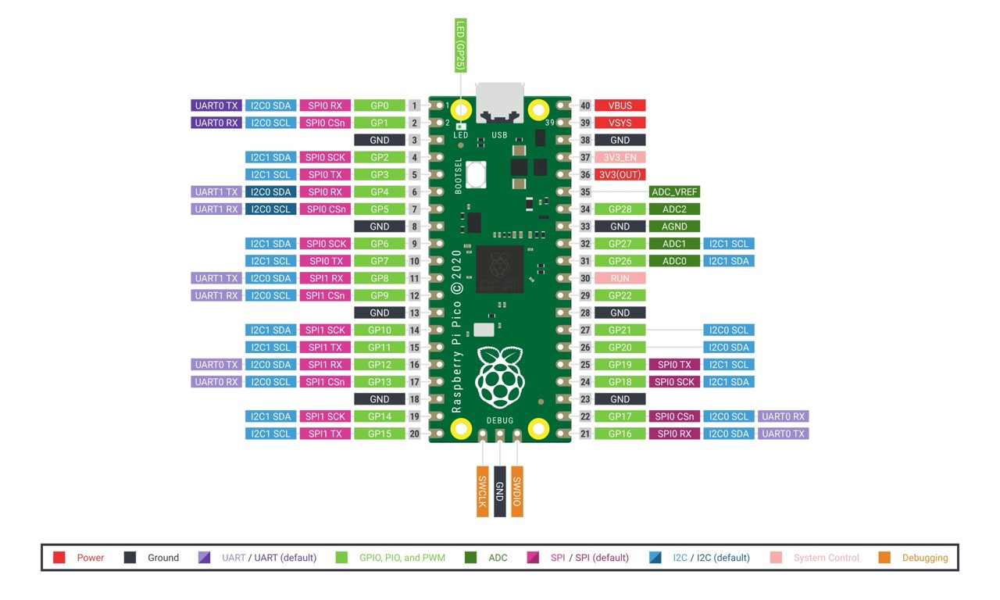

# Raspberry Pi Pico Monitor para el Controlador Solar Renogy Rover LI

## Descripción del Proyecto

Este proyecto permite monitorizar un controlador solar **Renogy Rover LI** utilizando una **Raspberry Pi Pico** con MicroPython. El sistema recopila datos del controlador solar a través de una conexión RS232 y ofrece las siguientes funcionalidades:

- Lectura de parámetros del controlador solar (voltaje, corriente, potencia, temperatura, etc.)
- Envío de datos a una API personalizada para almacenamiento y análisis
- Integración con Home Assistant para visualización y monitorización en tiempo real
- Indicadores LED para mostrar el estado del sistema
- Soporte para conexión WiFi (con la Raspberry Pi Pico W)

## Imágenes del Hardware

### Hardware del Proyecto
<p align="center">
  
  
  
</p>

### Diseño 3D del Hardware
<p align="center">
  
  
  
</p>

## Autor y Repositorio

- **Autor:** Raúl Caro Pastorino
- **Web:** [https://raupulus.dev](https://raupulus.dev)
- **Repositorio:** [https://gitlab.com/raupulus/rpi-pico-monitor-renogy-rover-li-solar-controller](https://gitlab.com/raupulus/rpi-pico-monitor-renogy-rover-li-solar-controller)
- **Proyecto base:** [https://gitlab.com/raupulus/rpi-pico-template-project-micropython](https://gitlab.com/raupulus/rpi-pico-template-project-micropython)

## Características Principales

- **Modelos Modulares**: El proyecto utiliza una arquitectura modular con clases especializadas:
  - **API**: Facilita la interacción con APIs externas para enviar y recibir datos
  - **RpiPico**: Gestiona la Raspberry Pi Pico, incluyendo conectividad WiFi, ADC integrado, información de red y soporte para redes alternativas
  - **RenogyRoverLi**: Implementa la comunicación con el controlador solar mediante protocolo Modbus
  - **SerialConnection**: Maneja la comunicación serial RS232 con el controlador
  - **HomeAssistantConnection**: Gestiona la integración con Home Assistant

- **Configuración Flexible**: Mediante el archivo de variables de entorno `.env.py` (basado en `.env.example.py`) se pueden personalizar todos los aspectos del sistema

- **Monitorización Visual**: Soporte para LEDs externos que indican el estado del sistema en tiempo real

## Integración con Home Assistant - Capturas

### Paneles de Home Assistant
<p align="center">
  
  
</p>

### Datos enviados a la API
<p align="center">
  
</p>

## Requisitos

### Software
- IDE/Editor (como Thonny, PyCharm o VSCode)
- [MicroPython 1.25](https://micropython.org/download/rp2-pico/) o superior 
  instalado en la Raspberry Pi Pico

### Hardware
- Raspberry Pi Pico (preferiblemente Pico W para funcionalidad WiFi)
- Controlador solar Renogy Rover Li
- Conversor TTL a RS232 para la comunicación con el controlador
- Opcional: LEDs externos para indicación visual del estado

## Contenido del Repositorio

- **src/**: Código fuente del proyecto que se ejecuta en la placa.
  - **src/Models/**: Modelos/Clases para separar entidades que intervienen.
- **tests/**: Scripts de prueba y verificación para el proyecto.
- **docs/**: Documentación técnica completa organizada por el protocolo de documentación:
  - **docs/info/**: Documentación técnica viva del proyecto ([Índice Maestro](docs/info/README.md)).
  - **docs/apis/renogy-rover/**: Especificación Modbus RTU oficial y verificada.
  - **docs/deploys/**: Guías de despliegue para Raspberry Pi Pico y Home Assistant.
  - **docs/future/**: Propuestas y mejoras acordadas pero aplazadas.
- **3d Design/**: Archivos de diseño 3D para la caja del microcontrolador.
- **AGENTS.md**: Contexto, arquitectura, tabla de trampas y reglas para agentes y desarrolladores.

## Archivos de Diseño 3D

Este proyecto incluye archivos de diseño 3D para crear una caja personalizada que aloje la Raspberry Pi Pico junto con el conversor RS232. Los archivos están disponibles en el directorio `3d Design/`:

### Archivos Disponibles

- **[Renogy Rover LI Raspberry pi pico - Base.stl](3d%20Design/Renogy%20Rover%20LI%20Raspberry%20pi%20pico%20-%20Base.stl)**: Archivo STL de la base de la caja
- **[Renogy Rover LI Raspberry pi pico - Cover.stl](3d%20Design/Renogy%20Rover%20LI%20Raspberry%20pi%20pico%20-%20Cover.stl)**: Archivo STL de la tapa de la caja
- **[Renogy Rover LI Raspberry pi pico.3mf](3d%20Design/Renogy%20Rover%20LI%20Raspberry%20pi%20pico.3mf)**: Archivo 3MF completo con el proyecto

### Características del Diseño

- Diseñado específicamente para alojar la Raspberry Pi Pico y el conversor TTL a RS232
- Incluye espacios para la conexión de cables
- Diseño modular con base y tapa separadas
- Optimizado para impresión 3D

> **Nota**: Estos archivos están listos para imprimir en cualquier impresora 3D compatible con archivos STL o 3MF.

## Instalación y Configuración

### Preparación del Hardware

1. Conecta el conversor TTL a RS232 a la Raspberry Pi Pico según el [Esquema de Conexiones](docs/info/hardware-connections.md)
2. Conecta el conversor RS232 al controlador solar Renogy Rover Li
3. Opcionalmente, conecta los LEDs externos a los pines GPIO correspondientes

### Instalación del Software

1. **Instalación de MicroPython y Carga:**
   - Sigue la [Guía de Despliegue en Raspberry Pi Pico](docs/deploys/rpi-pico-setup.md).
2. **Configuración de Entorno:**
   - Copia el archivo `src/.env.example.py` a `src/env.py` y configura WiFi, tokens y pines serie.
3. **Despliegue de Código:**
   - Consulta los comandos detallados en [Comandos y Despliegue](docs/info/commands.md).

## Diagrama de Conexiones

El siguiente diagrama muestra el esquema de conexiones entre la Raspberry Pi Pico y el controlador solar Renogy Rover Li:

### Raspberry Pi Pico a Conversor TTL-RS232

| Raspberry Pi Pico | Conversor TTL-RS232 |
|-------------------|---------------------|
| GPIO0 (Pin 1) - TX | RX                 |
| GPIO1 (Pin 2) - RX | TX                 |
| 3.3V (Pin 36)     | VCC (si es compatible con 3.3V) |
| GND (Pin 38)      | GND                 |

### Conversor TTL-RS232 a Renogy Rover Li

| Conversor TTL-RS232 (lado RS232) | Puerto RJ12 Renogy Rover Li |
|----------------------------------|----------------------------|
| TX                               | RX (Pin 3 en RJ12)        |
| RX                               | TX (Pin 4 en RJ12)        |
| GND                              | GND (Pin 5 en RJ12)       |

> **Nota:** Si tu conversor TTL-RS232 requiere 5V, usa el pin VSYS (Pin 39) o el pin de salida 5V en lugar de 3.3V. Consulta los detalles en [Esquema de Conexiones](docs/info/hardware-connections.md).

## Indicadores LED

El proyecto soporta tres LEDs externos opcionales para indicar diferentes estados:

1. **LED de Encendido**: Indica que el programa está en ejecución. Permanece encendido mientras el programa está activo.
2. **LED de Subida**: Indica cuando se están subiendo datos a la API o a Home Assistant. Se enciende durante las operaciones de subida.
3. **LED de Ciclo**: Indica cuando se está leyendo datos del controlador solar. Se enciende durante la lectura de datos.

Para configurar estos LEDs, define los siguientes parámetros en tu archivo `env.py`:

```python
# Configuración de LEDs externos (opcional)
LED_POWER_PIN = 15  # Número de pin GPIO para LED de encendido
LED_UPLOAD_PIN = 14  # Número de pin GPIO para LED de subida a API/Home Assistant
LED_CYCLE_PIN = 13  # Número de pin GPIO para LED de trabajo del ciclo
```

## Integración con Home Assistant

Este proyecto incluye una integración completa con Home Assistant, permitiendo visualizar todos los datos del controlador solar en tu panel de control agrupados bajo un único dispositivo físico:

- [Guía de Configuración en Home Assistant](docs/deploys/home-assistant-setup.md): Paquetes YAML, medidores de utilidad y paneles Lovelace.
- [Referencia Técnica de Integración REST](docs/info/apis/home-assistant.md): Detalles del endpoint y estructura de entidades.

### Herramientas de Prueba y Verificación

El proyecto incluye scripts en el directorio `tests/`:

1. **Verificación de Entidades** (`verify_entity_grouping.py`):
   - Verifica que todas las entidades existen en Home Assistant y valida su agrupación bajo el dispositivo correspondiente.
2. **Prueba de Creación de Dispositivo** (`test_device_creation.py`):
   - Comprueba la conectividad y la creación inicial del dispositivo en Home Assistant.

## Documentación Técnica

- **[Índice Maestro de Documentación Viva](docs/info/README.md)**: Módulos, arquitectura, decisiones y comandos.
- **[Especificación Modbus Renogy Rover Li](docs/apis/renogy-rover/README.md)**: Fundamentos, erratas, limitaciones y mapa de registros.
- **[Instrucciones para Agentes y Desarrolladores](AGENTS.md)**: Gotchas, trampas técnicas de MicroPython y protocolo de documentación.

## Licencia

Este proyecto está licenciado bajo la Licencia GPLv3. Consulta el archivo 
[LICENSE](LICENSE) para más detalles.

## Estado del Proyecto

El proyecto se encuentra en un estado funcional y estable. Se han implementado todas las funcionalidades principales:

- ✅ Lectura de datos del controlador solar Renogy Rover Li
- ✅ Envío de datos a API personalizada
- ✅ Integración con Home Assistant
- ✅ Soporte para LEDs externos de estado
- ✅ Optimización de rendimiento (caché de datos estáticos)
- ✅ Sincronización de hora con servidor NTP
- ✅ Monitorización del estado del microcontrolador

## Esquema de Pines - Raspberry Pi Pico

<p align="center">
  
</p>
